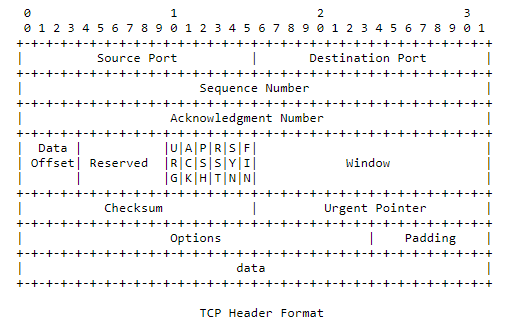

# 1.2 首部格式

&#x20;       TCP是一个通信协议，所谓协议就是通信各方约定好的通信规则。大家必须全部严格遵守这些规则，通信才能顺利完成。TCP的通信规则由一系列RFC来规范。首先是首部格式。

<figure><figcaption></figcaption></figure>

&#x20;       在Linux中对应的结构体为：

```clike
 //include/uapi/linux/tcp.h
 24 struct tcphdr {
 25     __be16  source;
 26     __be16  dest;
 27     __be32  seq;
 28     __be32  ack_seq;      
 29 #if defined(__LITTLE_ENDIAN_BITFIELD)
 30     __u16   res1:4,
 31         doff:4,
 32         fin:1,
 33         syn:1,
 34         rst:1,
 35         psh:1,
 36         ack:1,
 37         urg:1,
 38         ece:1,
 39         cwr:1;
 40 #elif defined(__BIG_ENDIAN_BITFIELD)
 41     __u16   doff:4,
 42         res1:4,
 43         cwr:1,
 44         ece:1,
 45         urg:1,
 46         ack:1,
 47         psh:1,
 48         rst:1,
 49         syn:1,
 50         fin:1;
 51 #else
 52 #error  "Adjust your <asm/byteorder.h> defines"
 53 #endif  
 54     __be16  window;
 55     __sum16 check;
 56     __be16  urg_ptr;
 57 };
```

字段说明:

* source：源端口号，取值范围1-65535； 　　
* dest：目的端口号，取值范围1-65535； 　
* seq：在SYN比特没有设置的情况下，seq是报文段中第一个字节的编号； 　
* ack\_seq：在ACK比特设置的情况下，ack\_seq是这个报文的发送者希望收到的下一个seq号； 　　

下面的16bit使用了位域，由于机器由于“大端序”与“小端序”的不同，读取和存储每个比特的顺序是相反的，故需要用条件编译来区分。

* doff：TCP头的大小，其数值乘4就是TCP头的字节数； 　
* Reserved: 留待将来使用，必须为0； 　

Control Bits: 　

* CWR：Congestion Window Reduced，用于拥塞控制； 　
* ECE：ECN-Echo，用于拥塞控制； 　
* URG：紧急指针域有效； 　
* ACK：确认号域有效； 　
* PSH：推送功能,TCP收到此标识应该将数据立即提交接收者；如在GRO处理流程中，如果发现此标记则不缓存包，直接交付协议栈； 　
* RST：重置连接； 　
* SYN：同步序列号，TCP通过设置此标志位告知对端起始序列号； 　
* FIN：送端不再有数据发送； 　
* 窗口：报文的发送者愿意接收的从ack\_seq开始的数据的字节数； 　
* 检验和：用TCP首部、数据部分和伪首部计算的检验和。伪首部由源IP地址、目的IP地址、协议号、TCP首部+数据的字节数构成； 　
* 紧急指针：表示紧急数据在此报文数据段中的偏移，即此报文的seq加上紧急指针的值就得到紧急数据的首序列号。这个字段仅在URG控制比特设置时才有效。

　　选项：doff乘４再减去TCP基本首部长度20字节即为选项字段长度。选项用于扩展TCP的功能，不是必须。比较重要的选项有最大报文段、窗口扩大、时间戳、选择确认。

　　使用struct tcphdr解析或构建TCP报文很简单，只要定义一个struct tcphdr结构体指针，将其指向TCP报文段的首地址，然后就可以对各个字段进行读写了。 　　

&#x20;       要特别说明的是，seq和ack\_seq都是无符号32位的整数。同一端的seq和ack\_seq之间是独立的，无任何联系，但接收端的ack\_seq与发送端的seq是同一空间。seq的取值范围为0-4294967295，初始的值是随机选取的，每发送一个字节的数据就消耗一个seq，SYN标志位和FIN标志位也会消耗一个seq。如果数据发送很快，seq就会很快回绕，这时TCP可能无法区分旧数据与新数据，这样就得通过时间戳选项等非法来解决这一问题（时间戳选项是后话）。

　　TCP协议自1981年由RFC 793提出到现在已经30多年了，其首部只是增加了CWR和ECE两个标记，以及增加了若干选项字段，现在仍然运转良好。相比之下IP协议就不得不伤筋动骨地向IPv6过渡，就不得不佩服当初协议设计者的远见卓识啊！

　　TCP首部字段只是内核使用，通过socket API使用TCP的用户是接触不到的（除非使用AF\_PACKET socket或RAW socket收发网络数据）。下面我们了解一下用socket API时TCP的基本使用方式。&#x20;
